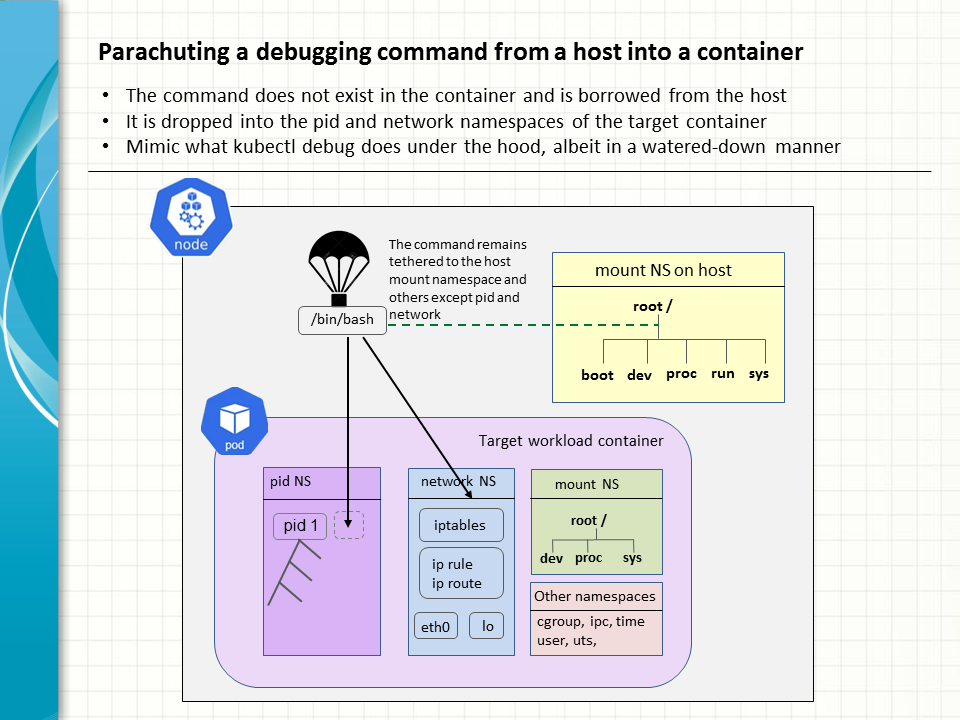

### Introduction

A short, nifty program is written to allow any given command to be injected from outside and executed in a container. Useful for data collection, diagnostics or other measures, it is intended to work as a lite version of kubetl debug without the overhead of running a full blown container in the same pod as the target. 

### TL;DR

*  The program accepts the name of a target container and a command to be executed therein as input arguments.
*  The given command is provided by the host and as such located in one of the host mount points.
*  Upon execution, the command joins the pid and network namespace of the given container.
*  The command goes on to mount /proc for process utilities like ps, top to work with the pid namespace of the container.

### Workflow details

1. Main program calls popen(2) with the crictl CLI to find out the global process ID of the initial process of the target container.
2. Main calls pidfd_open(2) and setns(2) to join the pid and network namepaces of the container.
3. Main calls unshare(2) to enter a new mount namespace that is initialised with a copy of the host mount points.
4. Main calls fork(2) to branch off to a child process.
5. Child calls mount(2) to set the /proc mount point MS_PRIVATE so that any subsequent mounts will not be progagated to the host. 
6. Child Calls mount(2) again to mount the proc of the pid namespace of the container on /proc properly.
7. Finally, child calls exec(2) to execute the given command and overlay itself.
