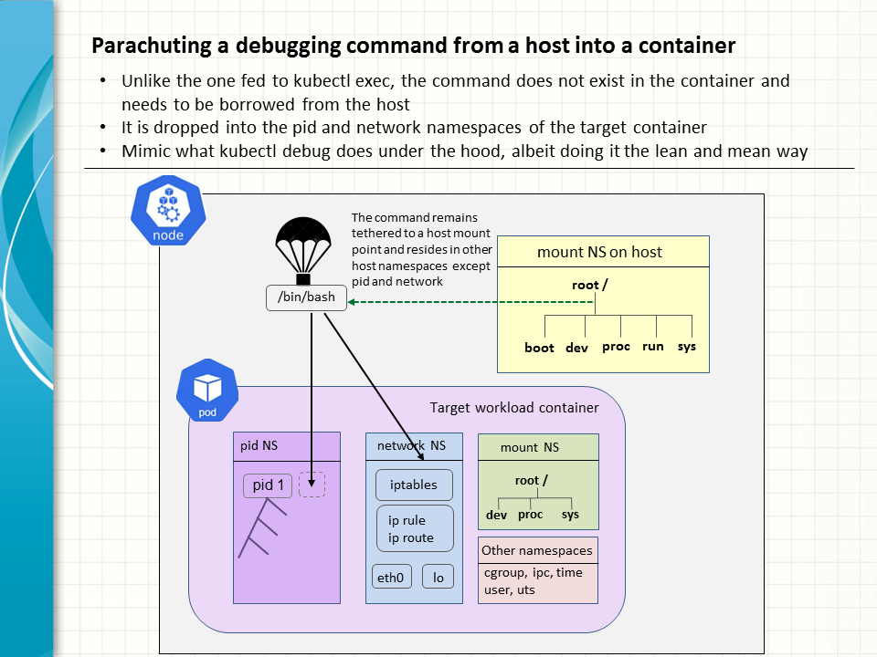

### Introduction

A short, nifty program is written to allow any given command to be injected from outside and executed in a container. Useful for data collection, diagnostics or other measures, it is intended to work as a lite version of kubetl debug without the overhead of running a full blown container in the same pod as the target. 



### TL;DR

*  The program accepts the name of a target container and a command to be executed therein as input arguments.
*  The given command is provided by the host and as such located in one of the host mount points.
*  Upon execution, the command joins the pid and network namespace of the given container.
*  Virtual file system proc is duly mounted on /proc to allow process utilities like ps, top to present the container pid namespace properly.

### Workflow details

1. Main program calls popen(2) with the crictl CLI to find out the global process ID of the initial process of the target container.
2. Main calls pidfd_open(2) and setns(2) to join the pid and network namepaces of the container.
3. Main calls unshare(2) to enter a new mount namespace that is initialised with a copy of the host mount points.
4. Main calls fork(2) to branch off to a child process.
5. Child calls mount(2) to set the /proc mount point MS_PRIVATE so that any subsequent mounts will not be progagated to the host. 
6. Child Calls mount(2) again to mount the proc for the pid namespace of the container on /proc properly.
7. Finally, child calls exec(2) to execute the given command and overlay itself.

### Test it out

The program is ready to be tested on a Killercoda Kubernetes playground or your preferable environment.
Download the source and compile it on the Kubernetes nodes.
```
gcc -o parachute_exec parachute_exec.c
```

Run a target K8s pod. Observe that the bash shell is not available in the container itself.
```
controlplane:~$ kubectl run curlybox --image=ferrgo/curlybox -- sleep "infinity"
pod/curlybox created
controlplane:~$ 
controlplane:~$ kubectl get pod -o wide                                         
NAME       READY   STATUS    RESTARTS   AGE   IP            NODE     NOMINATED NODE   READINESS GATES
curlybox   1/1     Running   0          20s   192.168.1.4   node01   <none>           <none>
controlplane:~$ 
controlplane:~$ kubectl exec -it curlybox -- bash
error: Internal error occurred: Internal error occurred: error executing command in container: failed to exec in container: failed to start exec "5eca3b04ac2f262bdfd9826f66485948ea530b43423e7ec8cd4a529fd37e13c7": OCI runtime exec failed: exec failed: unable to start container process: exec: "bash": executable file not found in $PATH: unknown
controlplane:~$
```

Go to the node where the target container is running and try out the featured program by executing bash in the target container.
```
node01:~$ ./parachute_exec curlybox bash
node01:~$ 
node01:~$ ps -ef
UID          PID    PPID  C STIME TTY          TIME CMD
root           1       0  0 18:14 ?        00:00:00 sleep infinity
root          13       0  0 18:19 pts/0    00:00:00 bash
root          26      13  0 18:19 pts/0    00:00:00 ps -ef
node01:~$
node01:~$ top
top - 18:22:19 up  1:12,  0 user,  load average: 0.02, 0.05, 0.02
Tasks:   3 total,   1 running,   2 sleeping,   0 stopped,   0 zombie
%Cpu(s):  4.8 us,  3.2 sy,  0.0 ni, 90.0 id,  0.0 wa,  0.0 hi,  0.0 si,  1.9 st 
MiB Mem :   1968.1 total,    122.4 free,    536.8 used,   1479.7 buff/cache     
MiB Swap:      0.0 total,      0.0 free,      0.0 used.   1431.4 avail Mem 

    PID USER      PR  NI    VIRT    RES    SHR S  %CPU  %MEM     TIME+ COMMAND                                                                
      1 root      20   0    1312    512    512 S   0.0   0.0   0:00.00 sleep                                                                  
     13 root      20   0    5760   5120   3328 S   0.0   0.3   0:00.01 bash                                                                   
     27 root      20   0    8916   5504   3328 R   0.0   0.3   0:00.00 top

node01:~$ ip -4 addr
1: lo: <LOOPBACK,UP,LOWER_UP> mtu 65536 qdisc noqueue state UNKNOWN group default qlen 1000
    inet 127.0.0.1/8 scope host lo
       valid_lft forever preferred_lft forever
3: eth0@if9: <BROADCAST,MULTICAST,UP,LOWER_UP> mtu 1500 qdisc noqueue state UP group default  link-netnsid 0
    inet 192.168.1.4/32 scope global eth0
       valid_lft forever preferred_lft forever
```

Commands invoked by the parachuted bash shell show that they are serving the pid and network namespace of the container. Meanwhile the shell still displays the name of the host for the prompt, cause it still belongs to the UTS namespace of the host.


